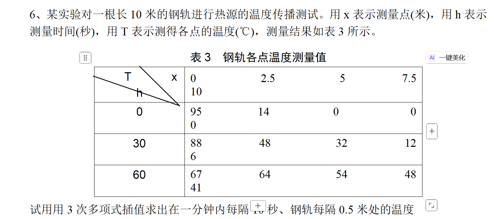

```ע��
                    _ooOoo_
                   o8888888o
                   88" . "88
                   (| -_- |)
                    O\ = /O
                ____/`---'\____
              .   ' \\| |// `.
               / \\||| : |||// \
             / _||||| -:- |||||- \
               | | \\\ - /// | |
             | \_| ''\---/'' | |
              \ .-\__ `-` ___/-. /
           ___`. .' /--.--\ `. . __
        ."" '.___\__/___.' >'""
       | | : `- \`.;`\ _ /`;.`/ - ` : | |
         \ \ `-. \_ __\ /__ _/ .-` / /
======`-.____`-.___\_____/___.-`____.-'======
                    `=---='
  
.............................................
         ���汣��             ����BUG
```
  
# matlab��ĩ��ϰ
/*
���ߣ���־��[^1]   
���ڣ�2025/11/11    
���ݣ������������ѧϰmatlab,����Ŭ���Ľ��     
*/
  
  
  
  
  
1. matlab������������ƺ�����
  
- Command Window������ڣ������������ִ�����
- Workspace��������������ʾ��ǰ��������ֵ��
- Command History��������ʷ������¼֮ǰִ�й������
- Current Folder����ǰ�ļ��У�����ʾ��ǰ����Ŀ¼�е��ļ����ļ��С�
- Editor���༭���������ڱ�д�ͱ༭�ű��ͺ����ļ���
- Figure Window��ͼ�δ��ڣ���������ʾ��ͼ��ͼ�Ρ�
  
2. ��������������
  
- ��������������ĸ��ͷ�����԰�����ĸ�����ֺ��»��ߣ�_����
- ���������ִ�Сд�����磬����A��a�Dz�ͬ�ı�����
- ������������MATLAB�Ĺؼ��ֻ����֣�����if��for��while�ȡ�
- ���������ܰ����ո�������ַ���
  
3. sqrt����
  
```matlab
y = sqrt(x);
```
  
����x��ƽ��������������洢�ڱ���y�С�
  
4. ð�ŷ���������
  
```matlab
v = start:step:end;
```
ע�⣺Ĭ�ϲ���Ϊ1��
  
5. linspace����
  
```matlab
v = linspace(start, end, numPoints);
```
  
����һ������numPoints�����������v����Χ��start��end��
  
6. find����
  
```matlab
index = find(condition);
```
  
���ݸ�����������������������Ԫ�ص���������������洢�ڱ���index�С�
  
7. mod����
  
```matlab
remainder = mod(a, b);
```
  
����a����b����������������洢�ڱ���remainder�С�
  
8. length����
  
```matlab
len = length(v);
```
  
��������v�ij��ȣ���������洢�ڱ���len�С�
  
9. disp����
  
```matlab
disp(message);
```
  
10. sprintf
  
```matlab
formattedString = sprintf('The value of x is %.2f', x);
```
  
11. fprintf
  
```matlab
fprintf('The value of x is %.2f\n', x);
```
  
12. meshgrid����
  
```matlab
[X, Y] = meshgrid(x, y);
```
  
���ɶ�ά�����������X��Y���ֱ��Ӧ����x��y��������ϡ�
  
13. eps����
  
```matlab
e = eps;
```
  
epsΪMATLAB�еĻ������ȣ���ʾ�����������е���С�����ֲ�ֵ�����������滻0������ֵ�Ƚϣ��Ա��⸡���������е���
  
14. figure����
  
```matlab
figure;
```
  
����һ���µ�ͼ�δ��ڡ�
  
15. grid on
  
```matlab
grid on;
```
  
�ڵ�ǰͼ�δ����д������ߡ�
  
16. plot����
  
```matlab
plot(x, y, 'r-');
```
  
��������x��y�Ķ�ά����ͼ��������������ʾ��������ɫ����ʽ����ɫ���� ������ RGB ��Ԫ�� ���
"red" "r" [1 0 0]
Sample of the color red
  
"green" "g" [0 1 0]
Sample of the color green
  
"blue" "b" [0 0 1]
Sample of the color blue
  
"cyan" "c" [0 1 1]
Sample of the color cyan
  
"magenta" "m" [1 0 1]
Sample of the color magenta
  
"yellow" "y" [1 1 0]
Sample of the color yellow
  
"black" "k" [0 0 0]
Sample of the color black
  
"white" "w" [1 1 1]
Sample of the color white
  
"-" ʵ��
Sample of solid line
  
"--" ����
Sample of dashed line
  
":" ����
Sample of dotted line
  
"-." �㻮��
Sample of dash-dotted line, with alternating dashes and dots
  
17. rand����
  
```matlab
r = rand(m, n);
```
  
����һ��m��n�еľ���r�������е�Ԫ��Ϊ���ȷֲ���(0, 1)������������
  
18. diag����
  
```matlab
d = diag(v);
```
  
������vת��Ϊ�ԽǾ���d��
  
19. kron����
  
```matlab
K = kron(A, B);
```
  
�������A��B��Kronecker������������洢�ھ���K�С�
  
20. inv����
  
```matlab
invA = inv(A);
```
  
�������A������󣬲�������洢�ھ���invA�С�
  
21. expand����
  
```matlab
syms x y
f1 = (x + 1)^3;
g1 = expand(f1);          % չ���ݣ�x^3 + 3*x^2 + 3*x + 1
  
f2 = (3*x^3 + x)*(x^3 + 1/2);
g2 = expand(f2);          % չ���˻����õ���һ����ʽ
  
f3 = (x + y)*(x - y);
g3 = expand(f3);          % -> x^2 - y^2
  
% �� factor �෴�IJ���
h  = factor(g1);          % ��չ���������ʽ�ֽ�Ϊ (x + 1)^3
```
  
˵����expand ���ڷ��ű���ʽ�Ĵ�����չ�������ѳ˻����ݡ����ŵ�չ���ɸ���֮�͡�ֻ������ syms �� symbolic ���ͣ��� factor �໥��ϣ�factor=��ʽ�ֽ⣬expand=չ���������ӱ���ʽչ�����������ܼ���������ע��ɶ���������.
  
22. quorem����
  
```matlab
syms x
N = (3*x^3 + x)*(x^3 + 1/2);      % ��������ʽ���ȿ� expand��
D = (x^2 + 2*x - 2)*(5*x^3 + 2*x^2 + 1);  % ��ʽ
N = expand(N);
D = expand(D);
  
[Q,R] = quorem(N, D, x);          % Q: �̶���ʽ  R: �����ʽ
```
  
���ã����������Ŷ���ʽ����������ʽ�Ķ���ʽ������������ Q ������ R���﷨ [Q,R] = quorem(A,B,x) �� A,B Ϊ���ڱ��� x �Ķ���ʽ��
  
���� R �Ĵ��� < ��ʽ B �Ĵ������� deconv ������quorem ������ű���ʽ��ֱ���� x����deconv ����ϵ����������ֻ���̻��࣬�ɷֱ��� Q = quorem(A,B,x) �� [~,R] = quorem(A,B,x)
  
23. fzero����
  
```matlab
% �﷨
x = fzero(fun, x0);          % ������ֵ��Ѱ�Ҹ�����ʵ��
x = fzero(fun, [a,b]);       % ��[a,b]��Ѱ����Ҫ�� fun(a)*fun(b)<0��
[x,fval,exitflag,output] = fzero(fun, x0, options);
  
% ����ʾ������ cos(x) - x = 0
fun = @(x) cos(x) - x;
root1 = fzero(fun, 0.5);     % 0.739085...
root2 = fzero(fun, [0,1]);   % �ṩ������䣬���Ƚ�
  
% �������ĺ������� x^3 - a = 0��ʵ����
a = 2;
root = fzero(@(x) x.^3 - a, [0, a]);  % 2 ��������
  
% ���þ��������
options = optimset('TolX',1e-12,'Display','off');
[x,fval,exitflag,output] = fzero(fun, 0.5, options);
```
  
Ҫ�㣺
  
- ���ã���һԪʵ���� fun(x) ��ʵ��㣨���/�����ڵ�һ��������
- ��ֵ�����䣺
  - ������ x0��fzero ������ͼ�� x0 �����Զ�Ѱ�ұ��������������
  - ������ [a,b]��Ҫ�� fun(a) �� fun(b) ��ţ�ͨ�����ɿ���
- ֻ֧�ֱ����Ա�������Ԫ�򷽳������� fsolve��
- �����㷨�����ַ������߷��������β�ֵ����ϣ����� fval��0 ��ʾ�ɹ���
- ����ѡ�TolX�������ݲ��Display��������Ϣ����
  
�������⣺
  
- ���䲻��Żᱨ���������������Ȼ�ͼ��ɨ��ȷ�����������ȡ�
- ֻ��ʵ�������踴���� roots ����ŷ�����
  
24. try-catch����
  
```matlab
try
    % ���ܳ����Ĵ���
catch
    % ����������
end
  
```
  
25. sqrt����
  
```matlab
y = sqrt(x);
```
  
����x��ƽ��������������洢�ڱ���y�С�
  
26. axis����
  
```matlab
plot(x,y);
axis([xmin xmax ymin ymax]);          % ���ö�ά���귶Χ
axis([xmin xmax ymin ymax zmin zmax]);% ��ά��Χ
axis tight;    % ��Χ�������պð���ȫ������
axis auto;     % �ָ��Զ�����
axis manual;   % �̶���ǰ��Χ������������Ƹı�
axis equal;    % x��y �ᵥλ���ȱ���һ��
axis square;   % ��ͼ������Ϊ������
axis image;    % �ȱ��� + �������ݣ���������ʾͼ��/����
axis off;      % ���������ᣨ����ʾ���ݣ�
axis on;       % ��ʾ������
axis ij;       % y ������Ϊ����ͼ������ϰ�ߣ�
axis xy;       % �ָ�Ĭ�ϣ�y ����Ϊ����
```
  
27. subplot ����
���ã���ͬһ Figure �аѻ�ͼ������Ϊ m��n �������ڵ� p �������ﴴ��/���������ᣬ���ڶ�ͼ�Աȡ�
  
�����﷨
  
```matlab
subplot(m, n, p)            % p �� 1 ��ʼ�����������ҡ����ϵ��¡����
subplot(m, n, [p1 p2 ...])  % ��һ����ͼ��Խ�������
ax = subplot(...);          % �����������������ڶ���
```
  
  
28. mesh �� surf ���������÷����Աȣ�
- ���ʣ�
  - mesh���߿�����wireframe����ֻ�������ߣ�������档
  - surf��ʵ�����棨surface��������Ƭ������ɫ�����ա�͸����
- ���루�ߴ���һ�£���
  - mesh(Z) �� mesh(X,Y,Z) �� mesh(X,Y,Z,C)
  - surf(Z) �� surf(X,Y,Z) �� surf(X,Y,Z,C)
  - ֻ�� Z ʱ��X=1:n��Y=1:m Ĭ�����ɹ�������
- �Ӿ������ܣ�
  - mesh ���������ʺϿ��ټ��������״���߽���������������䡣
  - surf ��ֱ�ۣ������ shading/lighting/camlight ��ƽ����������͸�����ʺ�չʾ��
- ������
  - surf(...,'EdgeColor','none') ȥ�����ߣ�����ʾƽ���档
  - surf(...,'FaceAlpha',0.6) ͸���ȣ�lighting gouraud; camlight headlight��
  - mesh(...,'MeshStyle','row'/'column'/'both') ���ƻ�����/�������ߡ�
- ������
  - ̽�����ԣ�mesh
  - �㱨չʾ/��Ҫ������ƽ��ɫ�ʣ�surf
- �״��㣺
  - ���� Z ʱ����Ԫ�����㣨.^��.*��./����
  - X��Y��Z �ߴ�һ�£��������� x,y���� Z �Ĵ�СӦΪ [length(y) �� length(x)]������ meshgrid ����ʽ��չ�õ�����
  
ʾ����ͬһ���ݵ� mesh �� surf �Ա�
```matlab
x = linspace(0,2*pi,50);
y = linspace(0,2*pi,50);
[X,Y] = meshgrid(x,y);
Z = sin(X).*cos(Y);
  
figure;
subplot(1,2,1);
mesh(X,Y,Z);
title('mesh �߿�����'); xlabel x; ylabel y; zlabel z; axis tight; grid on;
  
subplot(1,2,2);
surf(X,Y,Z);
shading interp;                 % ��Ƭ��ɫ��ֵ��ƽ��
lighting gouraud; camlight headlight;
title('surf ʵ������'); xlabel x; ylabel y; zlabel z; axis tight; grid on; colorbar;
```
  
29. size����
```matlab
[m,n] = size(A);   % ��ȡ���� A ������ m ������ n
```
  
30. str2func����
```matlab
fhandle = str2func(funcName);
```���ַ���funcNameת��Ϊ�������fhandle���Ա㶯̬���ú�����
  
31. fminsearch����
```matlab
% �﷨
x = fminsearch(fun, x0);    % �ӳ�ʼ�� x0 Ѱ�Һ��� fun �ľֲ���Сֵ��
[]
  
32. lasterr����
```matlab
msg = lasterr;
```
  
��ʾ������ԭ��
  
33. max����
  
```matlab
 = max(A);                 % �� A Ϊ���󣬵õ�ÿ�����ֵ���ص�1ά��
[m,idx] = max(A);           % ͬʱ�������ֵ����������ÿ��һ����
m = max(A,[],dim);          % �� dim ά��dim=1 �У�dim=2 �У�����άͬ����
m = max(A,[], 'all');       % ����Ԫ�ص����ֵ (R2018b+)
```
  
34. mean����
```matlab
m = mean(X);                   % ���������ֵ�������о�ֵ���ص�1ά��
m = mean(X, dim);              % ��ָ��ά�� dim ���ֵ��1=�У�2=�У�����
m = mean(X, 'all');            % ����Ԫ�صľ�ֵ��R2018b+��
m = mean(X, dim, 'omitnan');   % ���� NaN��Ĭ�� includenan ��õ� NaN��
```
  
Ҫ�㣺
  
- ���������ظ������ľ�ֵ�����󣺷���ÿ�о�ֵ����������N ά���飺�ص�һ���ǵ�һά��
- NaN �������� 'omitnan' ����ȱʧֵ��
- �߼����飺mean ����Ϊ true �ı�����
- �� sum/size ��ϵ��mean(X,dim) �� sum(X,dim) ./ size(X,dim)������ NaN ʱ������Ч��������
  
ʾ����
  
```matlab
X = [1 2 3; 4 5 NaN; 7 8 9];
  
mean(X)                   % -> [4 5 NaN]  ����
mean(X,2)                 % -> [2; NaN; 8] ����
```
  
34. std����
```matlab
s = std(X);                   % ���������׼������б�׼��ص�1ά��
s = std(X, dim);              % ��ָ��ά�� dim ���׼�1=�У�2=�У�����
s = std(X, 0, dim);           % ʹ�� N-1 ��Ϊ��ĸ��Ĭ�ϣ���0 ��ʾ������׼�� 
```
  
35. corrcoef����
- ������correlation coefficient ����д����ʾ�����ϵ������
- ���ã������������ݾ������֮��� Pearson ���ϵ��������������ˮƽ��p ֵ����
```matlab
[R, P] = corrcoef(A);   %��� R�����ϵ�����󣨶Խ���Ϊ 1����
��� P���� R ͬ�͵� p ֵ���󣨶Խ���Ϊ 0����
R = corrcoef(A); % ��������ϵ������
```
  
36. ��ֵ����
- interp1��һά��ֵ
  - 'nearest'������ڲ�ֵ
  - 'linear'�����Բ�ֵ
  - 'spline'������������ֵ
  - 'cubic'�����β�ֵ
- interp2����ά��ֵ
  - 'nearest'������ڲ�ֵ
  - 'linear'��˫���Բ�ֵ
  - 'cubic'�����β�ֵ
```matlab
% һά��ֵʾ��
f_linear  = interp1(x, f, x_interp, 'linear');  % ����
f_nearest = interp1(x, f, x_interp, 'nearest'); % ���ݣ�������
f_spline  = interp1(x, f, x_interp, 'spline');  % ������������ƽ�������ܹ���
f_cubic   = interp1(x, f, x_interp, 'cubic');   % ���β�ֵ��ƽ�������ܹ���
  
% ��ά��ֵʾ��
F_linear  = interp2(X, Y, F, Xq, Yq, 'linear');  % ˫����
F_nearest = interp2(X, Y, F, Xq, Yq, 'nearest'); % �����
F_cubic   = interp2(X, Y, F, Xq, Yq, 'cubic');   % ���β�ֵ
``` 

  
  
37. ��Ϻ���
- polyfit������ʽ���
  ```matlab
  p = polyfit(x, y, n); % ��� n �ζ���ʽ������ϵ������ p
  ```
- polyval������ʽ����
  ```matlab
y_fit = polyval(p, x_fit); % �������ʽ p �� x_fit ����ֵ
  ```
  
- polyder������ʽ��
  ```matlab
  p_der = polyder(p); % �������ʽ p �ĵ��������ص�����ϵ������ p_der
  ```
  
������polyfit = polynomial fit������ʽ��ϣ�polyval = polynomial evaluate������ʽ������polyder = polynomial derivative������ʽ�󵼡�
  
38. ��������
```matlab
f = @(x) x.^2 + 2*x + 1;  % ������������ f(x) = x^2 + 2x + 1
y = f(3);                  % ���ú��������� f(3)
```
  
39. ��Сдת��
  -upper����
  ```matlab
  str = 'hello world';
  str_upper = upper(str);  % ת��Ϊ��д��ĸ
  ```
������upper = upper case�����
  -lower����
  ```matlab
  str = 'HELLO WORLD';
  str_lower = lower(str);  % ת��ΪСд��ĸ
  ```
������lower = lower case��Сд��
  -isstrprop����
  ```
  lower_count = sum(isstrprop(str, 'lower'));% ����Сд��ĸ����
  ```
  ������isstrprop = is string property���ж��ַ������ԡ�
  
[^1]: ���˺�˧   
  