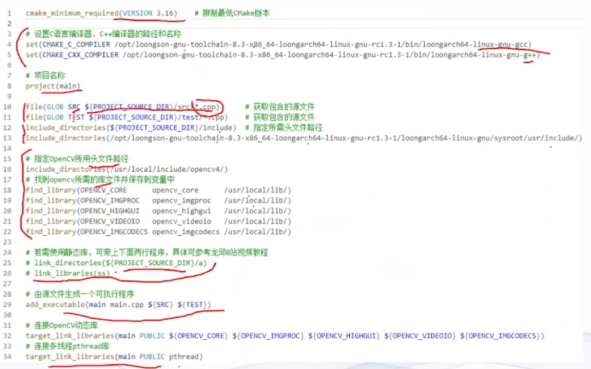
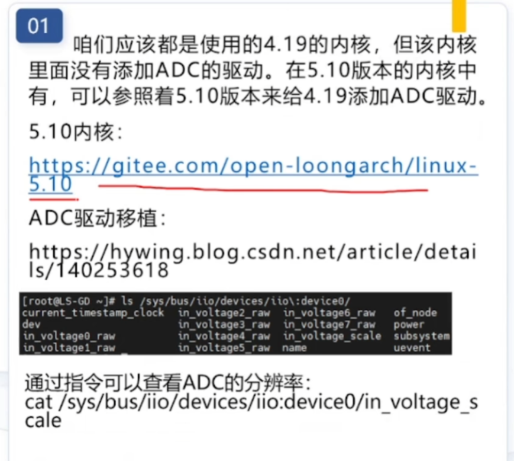

# 智能车学习日志
[[2025-11-12]]

1. 今天学习图像循迹，了解了灰度值阈值的计算方法(差比和)。以此来识别赛道的边界。（逐飞的推文《对比度算法》）
2. TOF避障，使用TOF测距模块
     - 利用光来测量距离
     - 使用IIC通信
3. 程序结构
   - 外设初始化：
      -  初始化屏幕
      -  初始化各类外设
      -  初始化定时器中断
4. 电机控制
   - 控制有刷电机的PWM信号的频率为17000HZ 
5. 速度闭环
   - 方向编码器
   - 正交编码器 
   - 增量式PID
6. 转向控制
   - 使用陀螺仪来增加转向的稳定性
   - 转角值 = 图像计算出的偏差 * KP + (本次偏差 - 上次偏差) * KD + 陀螺仪数值 * GKD
7. 了解了龙芯K300这一款芯片，下面决定再学一学这个Linux
8. 这个博主建议使用方向编码器

# 智能车学习日志
[[2025-11-17]]

1. SSH是一种加密的网络通信协议
2. Ubnuntu安装openssh-server的方法
   - sudo apt-get install openssh-server
3. 基本语法
   - ssh [可选参数] User@Hostname
   - 可选参数说明
     - -p 端口号
     - -i 指定密钥文件
     - -f 后台运行
     - -L 本地端口转发
     - -l 指定登录用户名
     - -F 指定配置文件

4. 免密登录
   - 别名登录  
      打开~/.ssh/config文件，添加如下内容
      ```
      Host 别名
          HostName 远程主机IP地址
          User 用户名
          Port 端口号//可以不用
      ```

   - 客户端生成密钥对
     - 命令：ssh-keygen
     - 作用：在用户目录~/.ssh/下生成公钥id_*.pub和私钥文件id_*。（*代表加密算法）
   - 客户端上传公钥到服务器
     - 命令：ssh-copy-id User@Hostname
     - 作用：将客户端生成的公钥上传到服务器的~/.ssh/authorized_keys文件中，实现免密登录
1. SCO命令行文件传输
   作用：使用一次命令传输一次
   基本语法：scp[可选参数]source_file target_file

1. VSC免密远程开发
2. github免密push
   - 生成ssh密钥对
   - 将公钥添加到github账号中
   - 测试连接：ssh -T

3. - 使用VOFA免费工具进行PID的调参。PID的单个电机的控制，一般采用双环控制，一般为速度环和位置环相结合
   - 小车的航向角，可以使用imu惯性传感器进行闭环控制
   - 电机的使用分为步进电机和无刷电机。无刷电机推荐使用ti公司的drv系列。直流电机的话使用TB6612驱动
   - 学会使用GIT .

1. ## 图像处理
   ### 搜线方法
   1. 图像中心搜线法
   2. 边缘跟踪搜线法

   ### 元素判断
   3. 十字判断
     
   4.  坡道检测
     - 用TOF激光测距来检测坡道，接近坡道时越来越小。
     - 接近坡道时，CCD图像向两边变宽。
     - 圆环识别

# 智能车学习日志
[[2025-11-20]]
1. 今天学习了如何使用GitHub进行代码的版本管理
2. 龙芯k0300到了
3. arc是龙芯的指令集架构
4. vi编辑器的使用
   - i 插入模式
   - esc 退出插入模式
   - :w 保存
   - :q 退出
   - :wq 保存并退出
5. 将k0300连接到电脑上
   - 使用ssh连接，连接上了wifi/


# 智能车学习日志
[[2025-11-21]]
1. 使用volatile变量的场景
  - 内存映射的寄存器变量
  - 中断和主程序共享的变量
  - 多线程共享的变量
  - 循环延时。
2. Linux常用命令
   ls - 列出目录内容
   cd - 更改目录
   pwd - 显示当前目录路径
   cp - 复制文件或目录
   mv - 移动或重命名文件或目录
   rm - 删除文件或目录
   mkdir - 创建新目录
   rmdir - 删除空目录
   touch - 创建空文件或更新文件的访问和修改时间
   cat - 显示文件内容
   more/less - 分页显示文件内容
   find - 查找文件或目录
   grep - 在文件中搜索文本模式
   chmod - 更改文件或目录的权限
3. reentrant 可重入函数
   - 函数在被中断后，可以被再次调用而不会引起错误


# 智能车学习日志
[[2025-11-22]]

1. 看gitlen这个插件的简介，就当学习英语了
2. 安装了ubuntu下的vscode和中文输入法。

# 智能车学习日志
[[2025-11-24]]
1. 龙芯k0300的适配显示屏型号
   - 飞凌嵌入式的LCD070CG+1024600FD31
2. Linux根目录简介
   - boot目录是存放板子和操作系统启动相关文件的目录
   - bin目录是存放系统二进制可执行文件的目录
   - lib目录是存放库函数的目录
3. 内核编译
4. QT Creator的安装和使用
5. 离散数据表
6. Cmake
7. cmake编译命令
   - sudo cmake -B build #项目构建
   - sudo cmake --build build #启动编译
8. ./main运行可执行程序
9. Linux地址映射
10. uintptr_t:一种无符号整数类型，足够大以容纳指针的值。内存映射的时候做页对其操作，能减少内存开销，方便系统对内存的分配和回收
11. Gtim配置
12. 5.10版本内核!!


# 智能车学习日志
[[2025-11-29]]
1. 配置了docker但是发现有坑，操作还挺麻烦，没有必要
2. 配置了wsl2，安装了ubuntu20.04
3. 龙芯交叉编译链loongarch64-linux-gnu-gcc

# 智能车学习日志
[[2025-12-03]]
1. 配置了clangd插件
2. ps -ef 查看进程树
3. kill -9 pid 强制杀死进程
4. 学习了龙芯久久派开机自启动程序的方法
   - 在/etc/rc.local文件中添加启动命令

# 智能车学习日志
[[2025-12-4]]
1. 学习了大津法图像二值化
   - 计算图像的直方图
   - 计算类间方差
   - 找到最大类间方差对应的阈值
2. 八邻域
   - 先二值化再滤波
3. 明天我将要学会八邻域连通域算法
4. 明天我必须要好好学习英语了

# 智能车学习日志
[[2025-12-5]]
1. 学习了yolo目标检测算法
   - yolo是You Only Look Once的缩写

# 智能车学习日志
[[2025-12-6]]
1. 能够在电脑上运行yolov8.n模型，并且进行目标检测
2. default.yaml文件的作用
   - 配置模型训练的参数

# 智能车学习日志
[[2025-12-7]]
1. 八邻域的原理
2. 八邻域的生长方向

# 智能车学习日志
[[2025-12-8]]
1. 学习了sobel算子
   - 用于边缘检测
   - 通过计算图像灰度的梯度来检测边缘
2. 研究学长的视觉代码看到了（寻找图像起始行的左右边界像素点），明天将要看八邻域+sobel算子提取左边界和右边界的方法

# 智能车学习日志
[[2025-12-15]]
1. Ubuntu的文件系统结构
   - 根目录/
   - bin目录：存放二进制可执行文件
   - boot目录：存放启动相关文件
   - dev目录：存放设备文件
   - etc目录：存放系统配置文件
   - home目录：存放用户个人文件
   - lib目录：存放库文件
   - media目录：存放可移动媒体设备挂载点 
   - opt目录：存放可选软件包
   - mnt目录：存放临时挂载点
2. linux df命令
   - 显示文件系统的磁盘空间使用情况
3. linux du命令
   - 显示文件和目录的磁盘使用情况
4. linux 磁盘挂载
   - mount命令用于将文件系统挂载到指定的目录
   - 通过添加-o iocharset=utf8参数，可以解决中文文件名乱码问题
   - umount命令用于卸载已挂载的文件系统
5. mkdir命令
   - 创建新目录