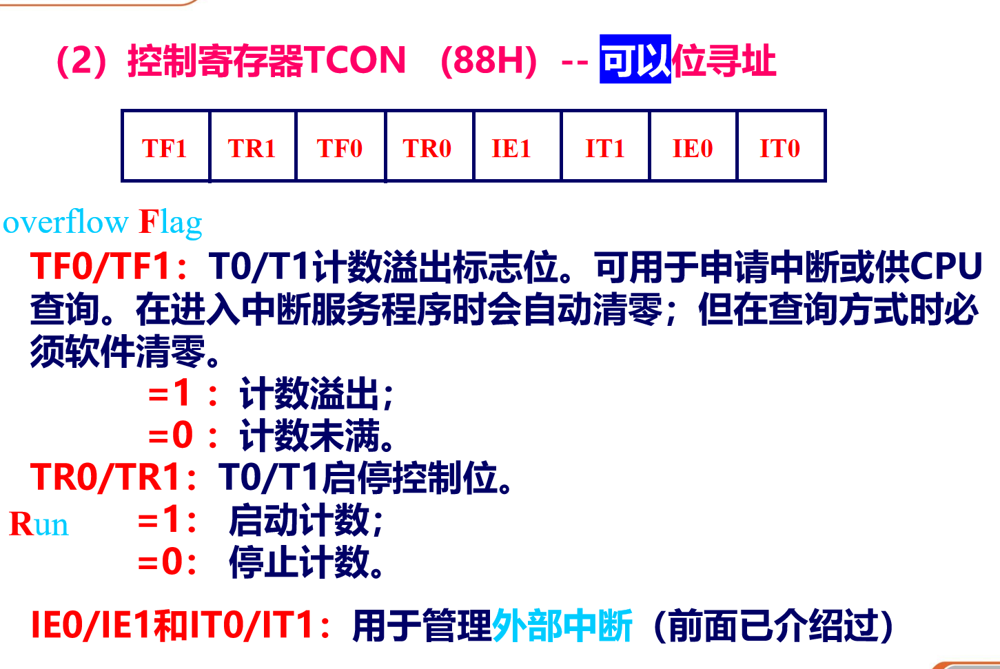
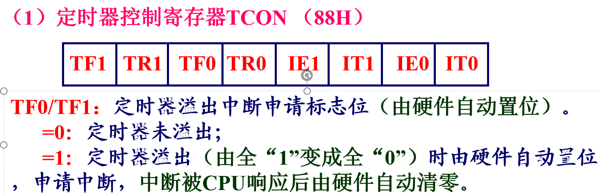
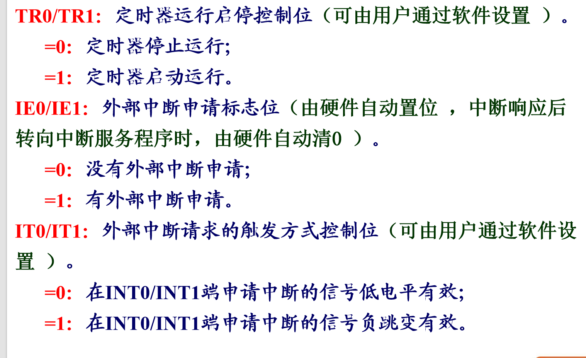

# 单片机基础知识

- 一个字节八位
- 00H为一个位地址

## 单片机的指令系统

1. MOV `<dest>`（目的）, `<src>`(源)内部RAM数据传送指令

## 中断响应的实时性和不确定性

## 外部中断

1. INT0(external interrupt 0)
2. INT1(external interrupt 1)
3. IT(Interrupt type) 0/1
4. IE(Interrupt enable) 0/1
5. TF0(Timer 0 overflow flag)
6. TF1(Timer 1 overflow flag)
7. PX0(Interrupt Priority)

[[2025-11-21]]

1. 
2. 
3. 
4. 定时器初始化的步骤
   - 设置定时器的工作方式
   - 设置定时器的初始值TH0/ TL0, TH1/ TL1。TH0表示定时器0的高8位，TL0表示低8位，TH1/TL1类似。
     - 分频系数：51单片机定时器使用系统时钟（晶振频率Fosc）经过12分频后的信号作为计数时钟。
     - 计数周期 = 12 / Fosc（例如Fosc=12MHz，计数周期=1μs）。
     - 16位模式初值公式：初值 = 65536 - T * (Fosc / 12)，其中T为定时时间（秒）。
     - TH = (初值 >> 8) & 0xFF，TL = 初值 & 0xFF。
   - 设置IE、IP寄存器，打开定时器中断及其优先级。
   - 置位TR0/ TR1，启动定时器。开启总中断
5. 
6. 
7. 
8. 

## 串口通信

1. - 
   - .png)

[[2025-11-28]]
